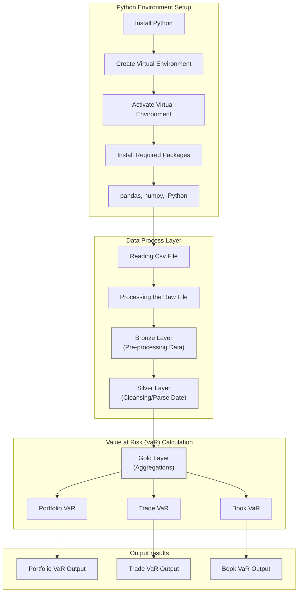

```mermaid
flowchart TD
    subgraph subGraph0["Python Environment Setup"]
        A["Install Python"] --> B["Create Virtual Environment"]
        B --> C["Activate Virtual Environment"]
        C --> D["Install Required Packages"]
        D --> E["pandas, numpy, IPython"]
    end

    subgraph subGraph1["Data Process Layer"]
        E --> F["Reading Csv File"]
        F --> G["Processing the Raw File"]
        G --> H["Bronze Layer<br/>(Pre-processing Data)"]
        H --> I["Silver Layer<br/>(Cleansing/Parse Date)"]
    end

    subgraph subGraph2["Value at Risk (VaR) Calculation"]
        I --> J["Gold Layer<br/>(Aggregations)"]
        J --> K["Trade VaR"]
        J --> L["Book VaR"]
        J --> M["Portfolio VaR"]
    end

    subgraph subGraph3["Output results"]
        M --> N["Portfolio VaR Output"]
        K --> O["Trade VaR Output"]
        L --> P["Book VaR Output"]
    end

    style H fill:#JJD700,stroke:#888,stroke-width:2px
    style I fill:#JJD700,stroke:#888,stroke-width:2px
    style J fill:#JJD700,stroke:#888,stroke-width:2px
    style N fill:#JJD700,stroke:#888,stroke-width:2px
    style O fill:#JJD700,stroke:#888,stroke-width:2px
    style P fill:#JJD700,stroke:#888,stroke-width:2px

    classDef bronze fill:#JJD700,stroke:#888,stroke-width:2px
    classDef silver fill:#JJD700,stroke:#888,stroke-width:2px
    classDef gold fill:#JJD700,stroke:#888,stroke-width:2px

    class H bronze
    class I silver
    class J gold
    class N gold
    class O gold
    class P gold
```
